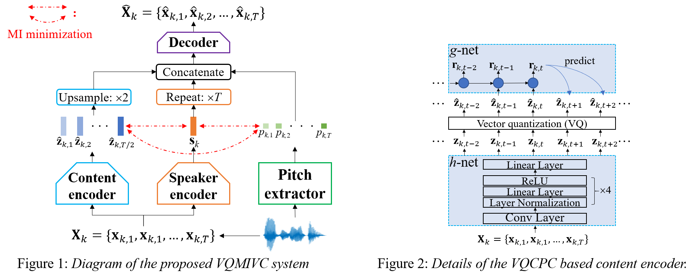

## VQMIVC: Vector Quantization and Mutual Information-Based Unsupervised Speech Representation Disentanglement for One-shot Voice Conversion (Interspeech 2021)
[](https://arxiv.org/abs/2106.10132)
[](https://github.com/Wendison/VQMIVC)
[](https://github.com/Wendison/VQMIVC/releases)

### [Run VQMIVC on Replicate](https://replicate.ai/wendison/vqmivc)
### Integrated to [Huggingface Spaces](https://huggingface.co/spaces) with [Gradio](https://github.com/gradio-app/gradio). See [Gradio Web Demo](https://huggingface.co/spaces/akhaliq/VQMIVC).

### Pre-trained models: [google-drive](https://drive.google.com/file/d/1Flw6Z0K2QdRrTn5F-gVt6HdR9TRPiaKy/view?usp=sharing) or [here](https://github.com/Wendison/VQMIVC/releases) | [Paper demo](https://wendison.github.io/VQMIVC-demo/)

This paper proposes a speech representation disentanglement framework for *one-shot/any-to-any* voice conversion, which performs conversion across arbitrary speakers with only a single target-speaker utterance for reference. Vector quantization with contrastive predictive coding (VQCPC) is used for content encoding and mutual information (MI) is introduced as the correlation metric during training, to achieve proper disentanglement of content, speaker and pitch representations, by reducing their inter-dependencies in an *unsupervised* manner. 

<p align="center">
	
</p>

## 📢 Update
Many thanks to [ericguizzo](https://github.com/ericguizzo) & [AK391](https://github.com/AK391)! 
1. A [Replicate demo](https://replicate.ai/wendison/vqmivc) is provided online, so you can play our pre-trained models there, have fun! 
2. VQMIVC can be trained and tested inside a Docker environment via [Cog](https://github.com/replicate/cog) now.
3. [Gradio Web Demo](https://huggingface.co/spaces/akhaliq/VQMIVC) is available, another online demo!

## TODO
- [ ] Add more details on how to use [Cog](https://github.com/replicate/cog) for development

## Requirements
Python 3.6 is used, install [apex](https://github.com/NVIDIA/apex) for speeding up training (optional), other requirements are listed in 'requirements.txt':

	pip install -r requirements.txt


## Quick start with pre-trained models
ParallelWaveGAN is used as the vocoder, so firstly please install [ParallelWaveGAN](https://github.com/kan-bayashi/ParallelWaveGAN) to try the [pre-trained models](https://drive.google.com/file/d/1Flw6Z0K2QdRrTn5F-gVt6HdR9TRPiaKy/view?usp=sharing):
	
	python convert_example.py -s {source-wav} -r {reference-wav} -c {converted-wavs-save-path} -m {model-path} 
	
For example:

	python convert_example.py -s test_wavs/p225_038.wav -r test_wavs/p334_047.wav -c converted -m checkpoints/useCSMITrue_useCPMITrue_usePSMITrue_useAmpTrue/VQMIVC-model.ckpt-500.pt 
	
The converted wav is put in 'converted' directory.
	

## Training and inference:
*  Step1. Data preparation & preprocessing
1. Put VCTK corpus under directory: 'Dataset/'
2. Training/testing speakers split & feature (mel+lf0) extraction:

		python preprocess.py

*  Step2. model training:
1. Training with mutual information minimization (MIM):
	
		python train.py use_CSMI=True use_CPMI=True use_PSMI=True

3. Training without MIM:
		
		python train.py use_CSMI=False use_CPMI=False use_PSMI=False 

*  Step3. model testing:
1. Put PWG vocoder under directory: 'vocoder/'
2. Inference with model trained with MIM:
		
		python convert.py checkpoint=checkpoints/useCSMITrue_useCPMITrue_usePSMITrue_useAmpTrue/model.ckpt-500.pt
	
3. Inference with model trained without MIM:

		python convert.py checkpoint=checkpoints/useCSMIFalse_useCPMIFalse_usePSMIFalse_useAmpTrue/model.ckpt-500.pt
	
## Citation
If the code is used in your research, please <a class="github-button" href="https://github.com/wendison/VQMIVC" data-icon="octicon-star" aria-label="Star wendison/VQMIVC on GitHub">Star</a> our repo and cite our paper:
```
@inproceedings{wang21n_interspeech,
  author={Disong Wang and Liqun Deng and Yu Ting Yeung and Xiao Chen and Xunying Liu and Helen Meng},
  title={{VQMIVC: Vector Quantization and Mutual Information-Based Unsupervised Speech Representation Disentanglement for One-Shot Voice Conversion}},
  year=2021,
  booktitle={Proc. Interspeech 2021},
  pages={1344--1348},
  doi={10.21437/Interspeech.2021-283}
}
```

## Acknowledgements:
* The content encoder is borrowed from [VectorQuantizedCPC](https://github.com/bshall/VectorQuantizedCPC), which also inspires the negative sampling within-utterance for CPC;
* The speaker encoder is borrowed from [AdaIN-VC](https://github.com/jjery2243542/adaptive_voice_conversion);
* The decoder is modified from [AutoVC](https://github.com/auspicious3000/autovc);
* Estimation of mutual information is modified from [CLUB](https://github.com/Linear95/CLUB);
* Speech features extraction is based on [espnet](https://github.com/espnet/espnet) and [Pyworld](https://github.com/JeremyCCHsu/Python-Wrapper-for-World-Vocoder).


