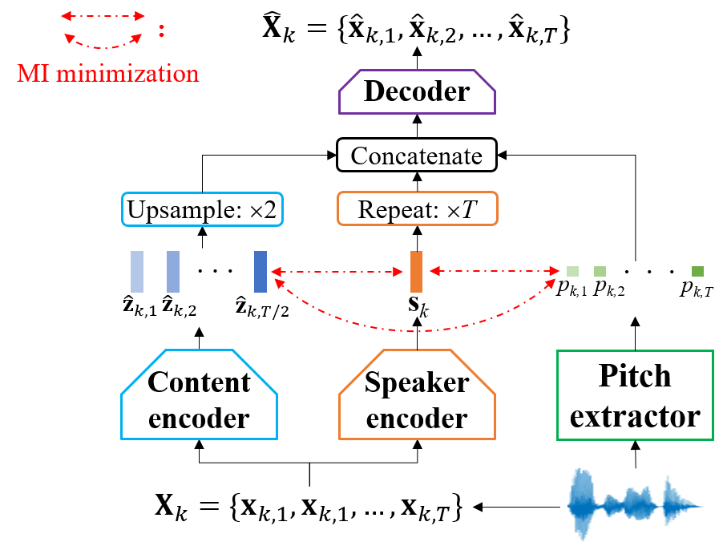

## VQMIVC: Vector Quantization and Mutual Information-Based Unsupervised Speech Representation Disentanglement for One-shot Voice Conversion (Interspeech 2021)
### [Paper](https://arxiv.org/abs/)(comming soon) | [Pre-trained models](https://drive.google.com/file/d/1Flw6Z0K2QdRrTn5F-gVt6HdR9TRPiaKy/view?usp=sharing) | [Demo](https://wendison.github.io/VQMIVC-demo/)

	

Diagram of the VQMIVC system.

## Requirements
Python 3.6 is used, other requirements are listed in 'requirements.txt'

	pip install -r requirements.txt
	
## Training and inference:
*  Step1. Data preparation & preprocessing
1. Put VCTK corpus under directory: 'Dataset/'
2. Training/testing speakers split & feature (mel+lf0) extraction:

		python preprocess.py

*  Step2. model training:
1. Training with mutual information minimization (MIM):
	
		python train.py use_CSMI=True use_CPMI=True use_PSMI=True

3. Training w/o MIM:
		
		python train.py use_CSMI=False use_CPMI=False use_PSMI=False 

*  Step3. model testing:
1. Put PWG vocoder under directory: 'vocoder/'
2. Inference with model trained with MIM:
		
		python convert.py checkpoint=checkpoints/useCSMITrue_useCPMITrue_usePSMITrue_useAmpTrue/model.ckpt-500.pt
	
3. Inference with model trained without MIM:

		python convert.py checkpoint=checkpoints/useCSMIFalse_useCPMIFalse_usePSMIFalse_useAmpTrue/model.ckpt-500.pt
